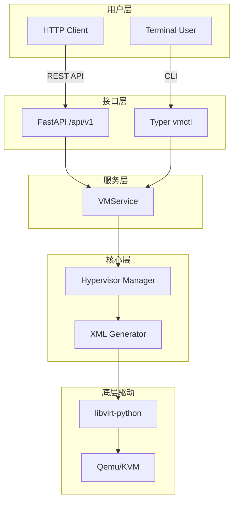
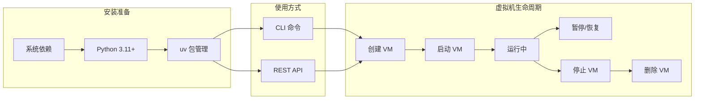

# 天工 (TianGong)

> 《天工开物》—— 中国古代科技巨著

`天工 (TianGong)` 是一个基于 Qemu/KVM 的虚拟机生命周期管理工具，提供 **CLI** 和 **REST API** 两种使用方式。

---

## 项目架构



## 用户流程图



---

## 功能特性

| 功能 | CLI | API |
|------|:---:|:---:|
| 创建/删除虚拟机 | ✅ | ✅ |
| 启动/停止/重启 | ✅ | ✅ |
| 暂停/恢复 | ✅ | ✅ |
| 状态监控 | ✅ | ✅ |
| 存储池管理 | ✅ | ✅ |
| 网络管理 | ✅ | ✅ |
| 美观的 Rich 输出 | ✅ | - |
| Swagger 文档 | - | ✅ |

---

## 快速开始

### 环境要求
- **操作系统**: Linux (支持 KVM)
- **Python**: 3.11+
- **包管理**: [uv](https://docs.astral.sh/uv/)

### 1. 安装系统依赖

```bash
# Ubuntu/Debian
sudo apt update
sudo apt install -y qemu-kvm libvirt-daemon-system libvirt-clients virtinst bridge-utils

# 添加用户到虚拟化组
sudo usermod -aG libvirt,kvm $USER
# 重新登录生效
```

### 2. 安装项目

```bash
git clone https://github.com/yourusername/tiangong.git
cd tiangong
uv sync
```

### 3. 验证安装

```bash
uv run vmctl --version
uv run vmctl check
```

---

## 使用方式

### CLI 工具 (vmctl)

```bash
# 查看帮助
vmctl --help
vmctl vm --help

# 虚拟机操作
vmctl vm list                        # 列出所有虚拟机
vmctl vm info <name>                 # 查看详情
vmctl vm create --name test-vm \
    --memory 2048 --vcpu 2 \
    --disk /var/lib/libvirt/images/test.qcow2
vmctl vm start test-vm               # 启动
vmctl vm stop test-vm                # 停止
vmctl vm delete test-vm --delete-disk  # 删除
```

### REST API

```bash
# 启动服务
uv run uvicorn src.api.main:app --reload --host 0.0.0.0 --port 8000

# 访问文档
open http://localhost:8000/docs
```

```bash
# 示例：创建虚拟机
curl -X POST http://localhost:8000/api/v1/vms \
  -H "Content-Type: application/json" \
  -d '{"name": "test-vm", "memory": 2048, "vcpu": 2,
       "disk_path": "/var/lib/libvirt/images/test.qcow2"}'
```

---

## 配置

### 配置文件

位置: `~/.vmctl/config.yaml`

```yaml
connection:
  uri: "qemu:///system"    # 系统级连接
  # uri: "qemu:///session"  # 用户级连接

vm_defaults:
  memory: 2048
  vcpu: 2
  disk_format: qcow2
  network: default

logging:
  level: "INFO"
  file: "~/.vmctl/vmctl.log"
```

### 环境变量

```bash
export LIBVIRT_DEFAULT_URI="qemu:///system"
export LOG_LEVEL="DEBUG"
```

---

## 项目结构

```
tiangong/
├── src/
│   ├── api/           # FastAPI REST API
│   ├── cli/           # Typer CLI 工具
│   ├── services/      # 业务服务层
│   ├── core/          # 核心模块 (libvirt 连接管理)
│   └── models/        # 数据模型
├── tests/             # 测试文件
├── config/            # 配置示例
├── scripts/           # 辅助脚本
└── pyproject.toml     # 项目配置
```

---

## 开发指南

```bash
# 安装开发依赖
uv sync --extra dev

# 运行测试
uv run pytest

# 代码检查
uv run ruff check src/ tests/
uv run mypy src/
```

---

## 学习资源

- [QEMU 官方文档](https://www.qemu.org/docs/master/)
- [KVM 官方文档](https://www.linux-kvm.org/page/Documents)
- [libvirt 官方文档](https://libvirt.org/docs.html)
- [FastAPI 文档](https://fastapi.tiangolo.com/)
- [Typer 文档](https://typer.tiangolo.com/)

---

## 许可证

MIT License - 详见 [LICENSE](LICENSE)

**作者**: 杨壮 (John Young) <john.young@foxmai.com>
