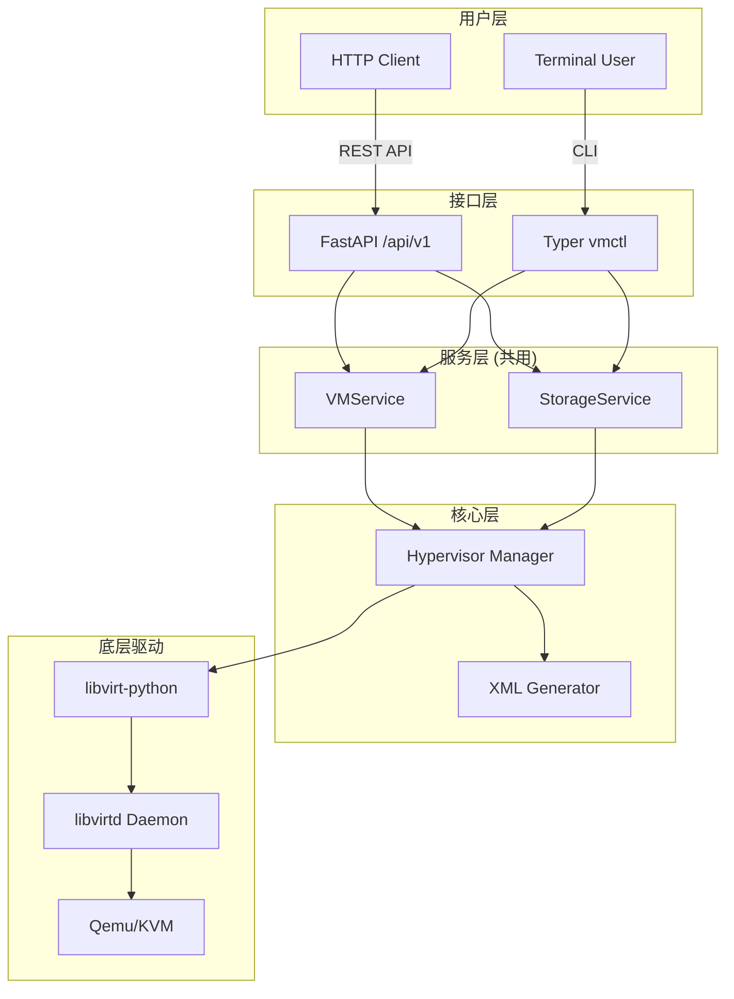

# x-qemu-kvm

基于 Qemu/KVM 的虚拟机生命周期管理学习与实践项目

**作者**: 杨壮 (John Young) <john.young@foxmai.com>
**许可证**: MIT
**版本**: 0.1.0

---

## 🎯 项目概述

这是一个用于学习和实践 **虚拟机生命周期管理** 的开源项目。项目提供：
- **REST API** (FastAPI) - 用于自动化集成
- **CLI 工具** (Typer) - 用于交互式管理
- **模块化设计** - 核心业务逻辑可复用

## 🏗️ 项目架构



## 📋 功能特性

### 虚拟机生命周期管理
- ✅ 创建/删除虚拟机
- ✅ 启动/停止/重启虚拟机
- ✅ 暂停/恢复虚拟机
- ✅ 虚拟机状态监控

### 资源管理
- 📁 存储池管理
- 🌐 虚拟网络管理
- 💾 磁盘镜像管理

### 用户体验
- 🖥️ 美观的 CLI 输出 (Rich)
- 📚 自动生成 API 文档 (Swagger UI)
- ⚙️ 配置文件支持

---

## 🚀 快速开始

### 环境要求
- **操作系统**: Linux (支持 KVM)
- **Python**: 3.11+
- **包管理**: [uv](https://docs.astral.sh/uv/)

### 安装系统依赖 (Ubuntu/Debian)
```bash
# 安装虚拟化相关软件包
sudo apt update
sudo apt install -y qemu-kvm libvirt-daemon-system libvirt-clients virtinst bridge-utils

# 将当前用户添加到 libvirt 和 kvm 组
sudo usermod -aG libvirt $USER
sudo usermod -aG kvm $USER
```

### 安装项目依赖
```bash
# 克隆项目
git clone https://github.com/yourusername/x-qemu-kvm.git
cd x-qemu-kvm

# 使用 uv 安装依赖
uv sync

# 验证安装
uv run vmctl --version
```

### CLI 使用示例
```bash
# 列出所有虚拟机
vmctl vm list

# 查看虚拟机详情
vmctl vm info <name_or_uuid>

# 创建虚拟机
vmctl vm create --name test-vm --memory 2048 --vcpu 2 --disk /var/lib/libvirt/images/test.qcow2

# 启动虚拟机
vmctl vm start test-vm

# 停止虚拟机
vmctl vm stop test-vm

# 删除虚拟机
vmctl vm delete test-vm --delete-disk
```

### API 使用示例
```bash
# 启动 API 服务
uv run uvicorn src.api.main:app --reload --host 0.0.0.0 --port 8000

# 创建虚拟机 (使用 curl)
curl -X POST http://localhost:8000/api/v1/vms \
  -H "Content-Type: application/json" \
  -d '{
    "name": "test-vm",
    "memory": 2048,
    "vcpu": 2,
    "disk_path": "/var/lib/libvirt/images/test.qcow2"
  }'

# 查看 API 文档
# 访问 http://localhost:8000/docs
```

---

## 📁 项目结构

```
x-qemu-kvm/
├── src/
│   ├── api/          # FastAPI REST API
│   │   ├── routers/  # API 路由
│   │   └── main.py   # FastAPI 应用入口
│   ├── cli/          # Typer CLI 工具
│   │   ├── commands/ # CLI 子命令
│   │   └── main.py   # CLI 入口
│   ├── services/     # 业务服务层 (API 和 CLI 共用)
│   │   └── vm_service.py  # VM 管理服务
│   ├── core/         # 核心模块
│   │   ├── hypervisor.py  # libvirt 连接管理
│   │   └── exceptions.py  # 自定义异常
│   └── models/       # 数据模型
│       └── vm.py     # 虚拟机数据模型
├── tests/            # 测试文件
│   ├── unit/         # 单元测试
│   ├── integration/  # 集成测试
│   └── e2e/          # 端到端测试
├── docs/             # 文档
├── scripts/          # 辅助脚本
├── pyproject.toml    # 项目配置 (uv)
└── README.md         # 项目说明
```

---

## 🛠️ 开发指南

### 设置开发环境
```bash
# 安装开发依赖
uv sync --extra dev

# 运行测试
uv run pytest

# 代码格式化
uv run black src/ tests/
uv run ruff check src/ tests/

# 类型检查
uv run mypy src/
```

### 添加新功能
1. 在 `src/models/` 中添加数据模型
2. 在 `src/services/` 中实现业务逻辑
3. 在 `src/api/routers/` 中添加 API 端点
4. 在 `src/cli/commands/` 中添加 CLI 命令
5. 在 `tests/` 中添加测试用例

---

## 🔧 配置说明

### CLI 配置文件
位置: `~/.vmctl/config.yaml`
```yaml
connection:
  uri: "qemu:///system"  # 或 qemu:///session

vm_defaults:
  memory: 2048
  vcpu: 2
  disk_format: qcow2
  network: default

logging:
  level: "INFO"
  file: "~/.vmctl/vmctl.log"
```

### 环境变量
```bash
# 设置 libvirt 连接 URI
export LIBVIRT_DEFAULT_URI="qemu:///system"

# 设置日志级别
export LOG_LEVEL="DEBUG"
```

---

## 📚 学习资源

### 虚拟化基础
- [QEMU 官方文档](https://www.qemu.org/docs/master/)
- [KVM 官方文档](https://www.linux-kvm.org/page/Documents)
- [libvirt 官方文档](https://libvirt.org/docs.html)

### 技术栈文档
- [libvirt Python API](https://libvirt.org/html/libvirt-libvirt.html)
- [Domain XML 格式](https://libvirt.org/formatdomain.html)
- [FastAPI 文档](https://fastapi.tiangolo.com/)
- [Typer 文档](https://typer.tiangolo.com/)

### 命令行参考 (virsh)
```bash
virsh list --all                    # 列出所有虚拟机
virsh dominfo <name>                # 查看虚拟机详情
virsh dumpxml <name>                # 查看虚拟机 XML 定义
virsh start/stop/reboot <name>      # 启动/停止/重启虚拟机
virsh snapshot-create/list/delete   # 快照管理
```

---

## 🤝 贡献指南

欢迎提交 Issue 和 Pull Request！

1. Fork 项目仓库
2. 创建功能分支 (`git checkout -b feature/amazing-feature`)
3. 提交更改 (`git commit -m 'Add some amazing feature'`)
4. 推送到分支 (`git push origin feature/amazing-feature`)
5. 开启 Pull Request

---

## 📄 许可证

本项目基于 MIT 许可证 - 查看 [LICENSE](LICENSE) 文件了解详情。

---

## 📞 联系方式

- **作者**: 杨壮 (John Young)
- **邮箱**: john.young@foxmai.com
- **项目地址**: https://github.com/yourusername/x-qemu-kvm

---

## 🌟 下一步

按照以下步骤开始使用：

1. **环境准备**: 配置 Linux 虚拟化环境
2. **安装依赖**: 使用 uv 安装项目依赖
3. **启动服务**: 运行 API 服务或使用 CLI
4. **创建虚拟机**: 通过 API 或 CLI 创建第一个虚拟机
5. **探索功能**: 尝试不同的生命周期操作

**Happy Virtualization! 🚀**